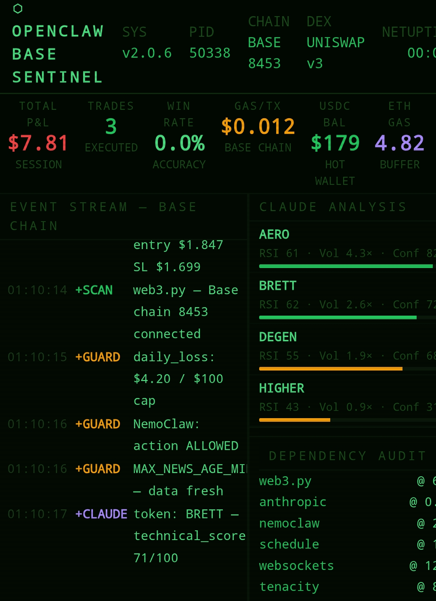

> Full setup guide: **[openclawtradingsetup.com](https://www.openclawtradingsetup.com)**
```

---

**Share link:**
```
https://github.com/openclawtradingsetup-cpu/openclaw-terminal


# OpenClaw Terminal Dashboard

Two React trading terminal dashboards inspired by hacker-aesthetic monitoring tools.

## Files

- `openclaw-terminal.jsx` — Polymarket / Polygon version
- `openclaw-base-terminal.jsx` — Base chain / Uniswap v3 version

## Run locally
```bash
npm create vite@latest my-dashboard -- --template react
cd my-dashboard
npm install recharts
# replace src/App.jsx with either file
npm run dev
```

## Connect to your real bot

See the full guide at openclawtradingsetup.com

## Dependencies

- React 18+
- Recharts

## License

MIT — free to use, modify, and share.
